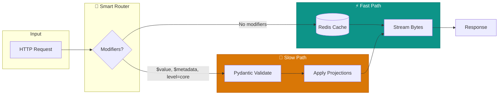

<div align="center">

# ⚡ Titan-AAS

### The High-Performance Asset Administration Shell Runtime


[](https://github.com/hadijannat/titan-aas/actions/workflows/ci.yml)
[](https://www.python.org/downloads/)
[](LICENSE)
[](https://industrialdigitaltwin.org)

**Production-grade AAS runtime optimized for read-heavy industrial workloads**

[🚀 Quick Start](#-quick-start) • [📖 Documentation](#-documentation) • [🏗️ Architecture](#-architecture) • [🧪 Testing](#-testing)

</div>

---

## 🎯 What is Titan-AAS?

> **For Non-Technical Readers**: Think of Titan-AAS as a "digital passport" system for industrial machines. Just like your passport contains all your identity information, an Asset Administration Shell (AAS) contains everything about a machine—its specifications, maintenance history, sensor data, and more. Titan-AAS is the software that stores, searches, and delivers this information incredibly fast.

**For Technical Readers**: Titan-AAS is a contract-first AAS runtime implementing the IDTA Release 25-01 specification bundle. It uses a novel **write-validate / read-stream** architecture that:

- ✅ **Validates** all incoming data with Pydantic v2 strict mode
- ⚡ **Streams** canonical bytes directly—no object hydration on reads
- 🔄 **Routes** requests through fast/slow paths based on query complexity
- 📦 **Stores** both JSONB (for queries) and canonical bytes (for streaming)

---

## ✨ Key Features


| Feature | Description |
|---------|-------------|
| ⚡ **Blazing Fast Reads** | Stream raw bytes from Redis cache—sub-millisecond response times |
| 🛡️ **IDTA Compliant** | Full implementation of Part 1 Metamodel + Part 2 API |
| 🔐 **Enterprise Security** | OIDC authentication, RBAC authorization, rate limiting |
| 📊 **Observable** | OpenTelemetry tracing + Prometheus metrics built-in |
| 🐳 **Cloud Native** | Helm charts, Terraform modules for AWS/Azure/GCP |
| 🔌 **Real-time Events** | WebSocket + MQTT for live asset updates |

---

## 🏗️ Architecture


### The Fast Path / Slow Path Pattern



### How It Works

1. **Write Path**: All writes go through Pydantic v2 validation → JSON canonicalization → stored as JSONB + canonical bytes
2. **Read Path (Fast)**: When no projections needed, stream raw bytes directly from Redis/Postgres
3. **Read Path (Slow)**: When modifiers like `$value` or `$metadata` are requested, hydrate model and transform
4. **Event Path**: Single writer pattern ensures consistent persistence and cache updates

---

## 📋 Specification Baseline

| Specification | Version | Status |
|--------------|---------|--------|
| IDTA-01001 Part 1 Metamodel | v3.1.2 | ✅ Implemented |
| IDTA-01002 Part 2 API | v3.1.1 | ✅ Implemented |
| IDTA-01003-a Data Specification IEC 61360 | v3.1.1 | ✅ Implemented |
| IDTA-01004 Security | v3.0.1 | ✅ Implemented |

---

## 🚀 Quick Start

### Prerequisites

- Python 3.12+
- [uv](https://github.com/astral-sh/uv) (recommended) or pip
- PostgreSQL 15+ and Redis 7+ (for production)

### Development Setup

```bash
# Clone the repository
git clone https://github.com/hadijannat/titan-aas.git
cd titan-aas

# Install dependencies with uv
uv sync

# Run the development server
uv run -- uvicorn titan.api.app:create_app --factory --host 0.0.0.0 --port 8080 --reload
```

### Docker Compose (Full Stack)

```bash
# Start all services (API, PostgreSQL, Redis, Prometheus, Grafana)
docker compose -f deployment/docker-compose.yml up -d

# Access the services
# API:        http://localhost:8080
# Swagger UI: http://localhost:8080/docs
# Grafana:    http://localhost:3000 (admin/admin)
```

---

## 📂 Repository Structure

```
titan-aas/
├── 📁 src/titan/           # Core runtime
│   ├── api/                # FastAPI routers & middleware
│   ├── core/               # Domain models & canonicalization
│   ├── persistence/        # PostgreSQL repositories
│   ├── cache/              # Redis caching layer
│   ├── events/             # Event bus & worker
│   ├── security/           # OIDC & RBAC
│   └── observability/      # Tracing & metrics
├── 📁 deployment/          # Docker & deploy artifacts
│   ├── Dockerfile          # Multi-stage production build
│   └── docker-compose.yml  # Full development stack
├── 📁 charts/titan-aas/    # Helm chart for Kubernetes
├── 📁 terraform/           # IaC for AWS/Azure/GCP
├── 📁 tests/               # Comprehensive test suite
│   ├── unit/               # 146 unit tests
│   ├── integration/        # 32 integration tests
│   ├── contract/           # OpenAPI conformance
│   └── load/               # Locust load tests
└── 📁 specs/               # Vendored IDTA OpenAPI specs
```

---

## 🧪 Testing

```bash
# Run all unit tests
uv run -- pytest tests/unit -v

# Run integration tests (requires Docker)
uv run -- pytest tests/integration -v

# Run with coverage
uv run -- pytest --cov=titan --cov-report=html

# Run load tests
uv run -- locust -f tests/load/locustfile.py --headless -u 100 -r 10 -t 60s
```

| Test Suite | Tests | Status |
|------------|-------|--------|
| Unit | 146 | ✅ Passing |
| Integration | 32 | ✅ Passing |
| Contract | 13 | ✅ Passing |
| E2E | 15 | ✅ Passing |

---

## 🔧 Configuration

Titan-AAS is configured via environment variables:

| Variable | Description | Default |
|----------|-------------|---------|
| `TITAN_ENV` | Environment (development/production) | `development` |
| `DATABASE_URL` | PostgreSQL connection string | `postgresql+asyncpg://...` |
| `REDIS_URL` | Redis connection string | `redis://localhost:6379/0` |
| `OIDC_ISSUER` | OIDC provider URL | *(disabled)* |
| `ENABLE_TRACING` | Enable OpenTelemetry | `true` |
| `ENABLE_METRICS` | Enable Prometheus metrics | `true` |

---

## 📖 Documentation

- [API Guide](docs/api-guide.md) - Complete API reference
- [Deployment Runbook](docs/deployment-runbook.md) - Production deployment guide
- [Architecture Decision Records](docs/adr/) - Design decisions

---

## 🤝 Contributing

Contributions are welcome! Please read our contributing guidelines before submitting a PR.

```bash
# Development workflow
uv sync --group dev          # Install dev dependencies
uv run -- ruff check src/    # Lint
uv run -- ruff format src/   # Format
uv run -- mypy src/titan     # Type check
uv run -- pytest             # Test
```

---

## 📜 License

This project is licensed under the MIT License - see the [LICENSE](LICENSE) file for details.

---

<div align="center">

**Built with ❤️ for the Industrial Digital Twin community**

[⬆ Back to top](#-titan-aas)

</div>
