<div align="center">

# ⚡ Titan-AAS

### The High-Performance Asset Administration Shell Runtime


[](https://github.com/hadijannat/titan-aas/actions/workflows/ci.yml)
[](https://www.python.org/downloads/)
[](LICENSE)
[](https://industrialdigitaltwin.org)

**Production-grade AAS runtime optimized for read-heavy industrial workloads**

[🚀 Quick Start](#-quick-start) • [📖 Documentation](#-documentation) • [🏗️ Architecture](#-architecture) • [🧪 Testing](#-testing)

</div>

---

## 🎯 What is Titan-AAS?

> **For Non-Technical Readers**: Think of Titan-AAS as a "digital passport" system for industrial machines. Just like your passport contains all your identity information, an Asset Administration Shell (AAS) contains everything about a machine—its specifications, maintenance history, sensor data, and more. Titan-AAS is the software that stores, searches, and delivers this information incredibly fast.

**For Technical Readers**: Titan-AAS is a contract-first AAS runtime implementing the IDTA Release 25-01 specification bundle. It uses a novel **write-validate / read-stream** architecture that:

- ✅ **Validates** all incoming data with Pydantic v2 strict mode
- ⚡ **Streams** canonical bytes directly—no object hydration on reads
- 🔄 **Routes** requests through fast/slow paths based on query complexity
- 📦 **Stores** both JSONB (for queries) and canonical bytes (for streaming)

---

## ✨ Key Features


| Feature | Description |
|---------|-------------|
| ⚡ **Blazing Fast Reads** | Stream raw bytes from Redis cache—sub-millisecond response times |
| 🛡️ **IDTA Compliant** | Core repository, registry, discovery, serialization (see conformance matrix) |
| 🔐 **Enterprise Security** | OIDC authentication, RBAC + ABAC authorization, rate limiting |
| 📊 **Observable** | OpenTelemetry tracing + Prometheus metrics + structured JSON logs with correlation IDs |
| 🐳 **Cloud Native** | Helm charts, Terraform modules for AWS/Azure/GCP |
| 🔌 **Real-time Events** | WebSocket + MQTT for live asset updates |
| 🤝 **Ecosystem Integrations** | Catena-X EDC/DTR connector scaffolds + Digital Product Passport generator (battery/PCF) |
| 🌐 **Federation** | Multi-instance synchronization with peer discovery |
| 📦 **AASX Packages** | Import/export with validation, versioning, conflict resolution |
| ☁️ **Multi-Cloud Storage** | S3, Azure Blob, GCS for binary attachments |
| 🖥️ **Admin UI** | React-based dashboard for monitoring and management |
| 🔋 **Edge Deployment** | Offline-first with background sync when connected |
| 🔌 **Plugin System** | Extensible with custom plugins and connectors |

---

## 🏗️ Architecture


### The Fast Path / Slow Path Pattern


### How It Works

1. **Write Path**: All writes go through Pydantic v2 validation → JSON canonicalization → stored as JSONB + canonical bytes
2. **Read Path (Fast)**: When no projections needed, stream raw bytes directly from Redis/Postgres
3. **Read Path (Slow)**: When modifiers like `$value` or `$metadata` are requested, hydrate model and transform
4. **Event Path**: Single writer pattern ensures consistent persistence and cache updates

### 🌐 Enterprise Features

#### Federation Architecture


**Features:**
- **Multi-Instance Sync**: Peer-to-peer or hub-spoke topology
- **Offline-First Edge**: Queue changes locally, sync when connected  
- **Delta Sync**: Only transfer changed data (bandwidth optimization)
- **Conflict Resolution**: Configurable strategies (skip, overwrite, error, rename)

#### AASX Package Management

```mermaid
flowchart LR
    Upload[📤 Upload AASX] --> Validate[🔍 OPC Validation]
    Validate --> Parse[📋 Parse Content]
    Parse --> Preview[👁️ Preview Import]
    Preview -->|Conflicts?| Resolve[⚡ Conflict Resolution]
    Resolve --> Import[💾 Import to Repo]
    Import --> Version[📊 Version Tracking]
```



**Capabilities:**
- OPC-compliant package validation
- Preview imports before committing
- Selective import (specific shells/submodels)
- Export with customizable options
- Version history with rollback

---

## 📋 Specification Baseline

| Specification | Version | Status |
|--------------|---------|--------|
| IDTA-01001 Part 1 Metamodel | v3.1.2 | ✅ Core models implemented |
| IDTA-01002 Part 2 API | v3.1.1 | ⚠️ Partial (see conformance matrix) |
| IDTA-01003-a Data Specification IEC 61360 | v3.1.1 | ⚠️ Partial (see conformance matrix) |
| IDTA-01004 Security | v3.0.1 | ⚠️ Partial (see security overview) |

---

## 🚀 Quick Start

### Prerequisites

- Python 3.11+
- [uv](https://github.com/astral-sh/uv) (recommended) or pip
- PostgreSQL 15+ and Redis 7+ (for production)

### Development Setup

```bash
# Clone the repository
git clone https://github.com/hadijannat/titan-aas.git
cd titan-aas
git submodule update --init --recursive

# Install dependencies with uv
uv sync

# Run the development server
uv run -- uvicorn titan.api.app:create_app --factory --host 0.0.0.0 --port 8080 --reload
```

### Docker Compose (Full Stack)

```bash
# Start all services (API, PostgreSQL, Redis, Prometheus, Grafana)
docker compose -f deployment/docker-compose.yml up -d

# Access the services
# API:        http://localhost:8080
# Swagger UI: http://localhost:8080/docs
# Grafana:    http://localhost:3000 (admin/admin)
```

### 🖥️ API Explorer

Once running, access the interactive Swagger UI at `http://localhost:8080/docs`:


The API is organized into these main sections:

| Section | Description | Key Endpoints |
|---------|-------------|---------------|
| **AAS Repository** | CRUD for Asset Administration Shells | `GET/POST /shells`, `GET/PUT/DELETE /shells/{id}` |
| **Submodel Repository** | CRUD for Submodels and Elements | `GET/POST /submodels`, `GET /submodels/{id}/submodel-elements` |
| **Registry** | Service discovery and descriptors | `GET/POST /shell-descriptors`, `GET /submodel-descriptors` |
| **Discovery** | Asset lookup by globalAssetId | `GET /lookup/shells`, `GET /lookup/submodels` |
| **Health** | Liveness and readiness probes | `GET /health/live`, `GET /health/ready` |

---

## 🔬 Technical Demo

> **Try these examples** against a running Titan-AAS instance to explore its capabilities.

### 1. Create an Asset Administration Shell

```bash
# Create a new AAS for a robotic arm
curl -X POST http://localhost:8080/shells \
  -H "Content-Type: application/json" \
  -d '{
    "id": "urn:titan:aas:robot-arm-001",
    "idShort": "RobotArm001",
    "assetInformation": {
      "assetKind": "Instance",
      "globalAssetId": "urn:titan:asset:kuka-kr-16"
    },
    "submodelRefs": []
  }'
```

**Response** (201 Created):
```json
{
  "id": "urn:titan:aas:robot-arm-001",
  "idShort": "RobotArm001",
  "assetInformation": {
    "assetKind": "Instance",
    "globalAssetId": "urn:titan:asset:kuka-kr-16"
  }
}
```

### 2. Create a Submodel with Real Sensor Data

```bash
# Create a Technical Data submodel
curl -X POST http://localhost:8080/submodels \
  -H "Content-Type: application/json" \
  -d '{
    "id": "urn:titan:submodel:technical-data-001",
    "idShort": "TechnicalData",
    "semanticId": {
      "type": "ExternalReference",
      "keys": [{"type": "GlobalReference", "value": "https://admin-shell.io/ZVEI/TechnicalData/Submodel/1/2"}]
    },
    "submodelElements": [
      {
        "modelType": "Property",
        "idShort": "MaxPayload",
        "valueType": "xs:double",
        "value": "16.0",
        "semanticId": {
          "type": "ExternalReference",
          "keys": [{"type": "ConceptDescription", "value": "0173-1#02-AAB994#007"}]
        }
      },
      {
        "modelType": "Property",
        "idShort": "ReachRadius",
        "valueType": "xs:double",
        "value": "1611.0"
      },
      {
        "modelType": "SubmodelElementCollection",
        "idShort": "OperationalLimits",
        "value": [
          {"modelType": "Property", "idShort": "MaxTemperature", "valueType": "xs:double", "value": "55.0"},
          {"modelType": "Property", "idShort": "MinTemperature", "valueType": "xs:double", "value": "5.0"}
        ]
      }
    ]
  }'
```

### 3. Query with Projections (Slow Path)

```bash
# Get only the value of a specific property
curl "http://localhost:8080/submodels/dXJuOnRpdGFuOnN1Ym1vZGVsOnRlY2huaWNhbC1kYXRhLTAwMQ/submodel-elements/MaxPayload/\$value"

# Response: 16.0
```

```bash
# Get submodel with level=core (minimal response)
curl "http://localhost:8080/submodels/dXJuOnRpdGFuOnN1Ym1vZGVsOnRlY2huaWNhbC1kYXRhLTAwMQ?level=core"
```

### 4. Streaming Performance Demo

```python
import httpx
import time

# Benchmark: Fast path vs Slow path
client = httpx.Client(base_url="http://localhost:8080")

# Fast path: Direct byte streaming (no modifiers)
start = time.perf_counter()
for _ in range(1000):
    client.get("/shells/dXJuOnRpdGFuOmFhczpyb2JvdC1hcm0tMDAx")
fast_time = time.perf_counter() - start

# Slow path: With projection modifier
start = time.perf_counter()
for _ in range(1000):
    client.get("/shells/dXJuOnRpdGFuOmFhczpyb2JvdC1hcm0tMDAx?level=core")
slow_time = time.perf_counter() - start

print(f"Fast path: {fast_time*1000:.2f}ms for 1000 requests")
print(f"Slow path: {slow_time*1000:.2f}ms for 1000 requests")
print(f"Fast path is {slow_time/fast_time:.1f}x faster")
```

### 5. Real-time WebSocket Events

```javascript
// Subscribe to live asset updates
const ws = new WebSocket('ws://localhost:8080/ws/events');

ws.onmessage = (event) => {
  const aasEvent = JSON.parse(event.data);
  console.log(`[${aasEvent.type}] ${aasEvent.source}: ${aasEvent.payload.idShort}`);
};

// Output:
// [CREATED] urn:titan:aas:robot-arm-001: RobotArm001
// [UPDATED] urn:titan:submodel:technical-data-001: TechnicalData
```

### 6. Conditional Requests with ETags

```bash
# First request - get the ETag
RESPONSE=$(curl -i http://localhost:8080/shells/dXJuOnRpdGFuOmFhczpyb2JvdC1hcm0tMDAx)
ETAG=$(echo "$RESPONSE" | grep -i etag | cut -d'"' -f2)

# Conditional update - only if resource hasn't changed
curl -X PUT http://localhost:8080/shells/dXJuOnRpdGFuOmFhczpyb2JvdC1hcm0tMDAx \
  -H "Content-Type: application/json" \
  -H "If-Match: \"$ETAG\"" \
  -d '{"id": "urn:titan:aas:robot-arm-001", "idShort": "RobotArm001-Updated", ...}'

# Returns 200 OK if successful, 412 Precondition Failed if resource changed
```

### 7. Pagination with Cursors

```bash
# Get first page of submodels
curl "http://localhost:8080/submodels?limit=10"

# Response includes cursor for next page:
# {
#   "result": [...],
#   "paging_metadata": {"cursor": "2024-01-10T12:00:00.000Z"}
# }

# Get next page
curl "http://localhost:8080/submodels?limit=10&cursor=2024-01-10T12:00:00.000Z"
```

### 8. Health & Observability

```bash
# Liveness probe (always available)
curl http://localhost:8080/health/live
# {"status": "ok"}

# Readiness probe (checks DB + Redis)
curl http://localhost:8080/health/ready
# {"status": "ok", "checks": {"database": "ok", "redis": "ok"}}

# Prometheus metrics
curl http://localhost:8080/metrics
# titan_http_requests_total{method="GET",path="/shells",status="200"} 1234
# titan_http_request_duration_seconds_bucket{...} 0.001
```

## 📂 Repository Structure

```
titan-aas/
├── 📁 src/titan/           # Core runtime
│   ├── api/                # FastAPI routers & middleware
│   ├── core/               # Domain models & canonicalization
│   ├── persistence/        # PostgreSQL repositories
│   ├── cache/              # Redis caching layer
│   ├── events/             # Event bus & worker
│   ├── security/           # OIDC & RBAC
│   └── observability/      # Tracing & metrics
├── 📁 deployment/          # Docker & deploy artifacts
│   ├── Dockerfile          # Multi-stage production build
│   └── docker-compose.yml  # Full development stack
├── 📁 charts/titan-aas/    # Helm chart for Kubernetes
├── 📁 terraform/           # IaC for AWS/Azure/GCP
├── 📁 tests/               # Comprehensive test suite
│   ├── unit/               # 146 unit tests
│   ├── integration/        # 32 integration tests
│   ├── contract/           # OpenAPI conformance
│   └── load/               # Locust load tests
└── 📁 specs/               # Vendored IDTA OpenAPI specs
```

---

## 🧪 Testing

```bash
# Run all unit tests
uv run -- pytest tests/unit -v

# Run integration tests (requires Docker)
uv run -- pytest tests/integration -v

# Run with coverage
uv run -- pytest --cov=titan --cov-report=html

# Run load tests
uv run -- locust -f tests/load/locustfile.py --headless -u 100 -r 10 -t 60s
```

| Test Suite | Tests | Status |
|------------|-------|--------|
| Unit | 606 | ✅ Passing |
| Integration | 91 | ✅ Passing |
| Contract | 15 | ✅ Passing |
| E2E | 17 | ✅ Passing |

---

## 🔧 Configuration

Titan-AAS is configured via environment variables:

### Core Settings

| Variable | Description | Default |
|----------|-------------|---------|
| `TITAN_ENV` | Environment (development/production) | `development` |
| `DATABASE_URL` | PostgreSQL connection string | `postgresql+asyncpg://...` |
| `REDIS_URL` | Redis connection string | `redis://localhost:6379/0` |
| `OIDC_ISSUER` | OIDC provider URL | *(disabled)* |
| `ENABLE_TRACING` | Enable OpenTelemetry | `true` |
| `ENABLE_METRICS` | Enable Prometheus metrics | `true` |

### Blob Storage

| Variable | Description | Default |
|----------|-------------|---------|
| `BLOB_STORAGE_TYPE` | Storage backend: `local`, `s3`, `azure`, `gcs` | `local` |
| `S3_BUCKET` / `AWS_ACCESS_KEY_ID` | S3 configuration | — |
| `AZURE_CONTAINER` / `AZURE_STORAGE_CONNECTION_STRING` | Azure Blob configuration | — |
| `GCS_BUCKET` / `GCS_PROJECT` | Google Cloud Storage configuration | — |

### Federation & Edge

| Variable | Description | Default |
|----------|-------------|---------|
| `FEDERATION_ENABLED` | Enable multi-instance federation | `false` |
| `EDGE_MODE` | Run as edge node (offline-capable) | `false` |
| `HUB_URL` | Hub URL for edge sync | — |

---

## 📖 Documentation

- **[🚀 Try It Yourself](docs/try-it-yourself.md)** - Hands-on guide to verify each claimed functionality
- [API Guide](docs/api-guide.md) - Complete API reference
- [Deployment Runbook](docs/deployment-runbook.md) - Production deployment guide
- [High Availability Guide](docs/ha-guidance.md) - Active-active deployment patterns
- [Conformance Matrix](docs/conformance-matrix.md) - IDTA service profile coverage
- [Interop Matrix](docs/interop-matrix.md) - Endpoint-level interoperability details
- [Benchmarks](docs/benchmarks.md) - Reproducible performance runs
- [Production Readiness](docs/production-readiness.md) - Release gates and go-live checklist
- [Release Process](docs/release-process.md) - Versioning and release workflow
- [Architecture Decision Records](docs/adr/) - Design decisions
- [Security Overview](docs/security.md) - Authentication and rate limiting
- [Security Modes](docs/security-modes.md) - AuthN/AuthZ configuration matrix
- [Security Policy](SECURITY.md) - Vulnerability reporting
- [Security Advisories](docs/security-advisories.md) - Reviewed CVE exceptions
- [Changelog](CHANGELOG.md) - Release history

---

## 🤝 Contributing

Contributions are welcome! Please read our contributing guidelines before submitting a PR.

```bash
# Development workflow
uv sync --group dev          # Install dev dependencies
uv run -- ruff check src/    # Lint
uv run -- ruff format src/   # Format
uv run -- mypy src/titan     # Type check
uv run -- pytest             # Test
```

---

## 📜 License

This project is licensed under the MIT License - see the [LICENSE](LICENSE) file for details.

---

<div align="center">

**Built with ❤️ for the Industrial Digital Twin community**

[⬆ Back to top](#-titan-aas)

</div>
